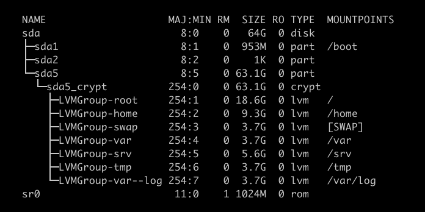
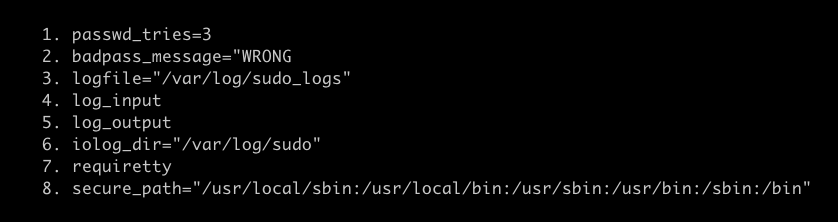
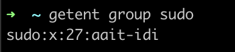
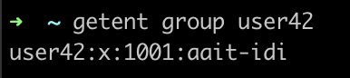

*This project has been created as part of the 42 curriculum by aait-idi*

## **<font color="#569dd7">DESCRIPTION</font>**

welcome to born2beroot, what's a better project to learn about virtualization and system administration?

#### **<font color="#569dd7"> This Project Contain : </font>**

* sitting up a virual machine using virtualBox or UTM.
* installing debian along with a specific partitioning setup.
* Implementing strict security rules (sudo config, strong passwords, ufw, etc).
* configure ssh service with a different port (with security rules too of course).
* creating a monitoring script thats boardcasts some system stats every 10min.
* deploy a working web server combo (lighttpd, php and Mariadb).
* sitting up a service of our choice.

## **<font color="#569dd7">PROJECT DESCRIPTION</font>**

why debian?... isn't it obvious? rocky is harder :]
thats why debian xD.

#### **<font color="#569dd7"> THE WHY DEBIAN OVER ROCKY: </font>**

* **STABILITY:** debian is known for it's rock solid stability, real good for servers.
* **PACKAGE MANAGER:** whats a better package manager than apt? except pacman of course hehe, apt is very well-documented and intuitive.
* **COMMUNITY:** large community = a loooot of documentation.
* **BEGINNER-FRIENDLY:** easy for system administration.
* **LONG-TERM SUPPORT:** has stables releases that's supported for years.
* **LIGHTWEIGHT:** runs efficiently even in bad hardware.
* **APP ARMOR:** simpler than SELinux for learning.
* **FIREWALL:** UFW is easier for beginners.
* and lastly its recommended in born2beroot, so why not?

#### **<font color="#569dd7"> THE CONSEQUENCES: </font>**

* **OLDER PACKAGES:** stable versions have some outdated softwares.
* **LESS CORPORATE SUPPORT:** no commercial backing like Rocky/RHEL.
* **FEWER ENTERPRISE FEATURES:** not as focused on enterprise envirements.

#### **<font color="#569dd7"> PARTITION SCHEME:	`lsblk` </font>**



*what each is for?*

| NAME            | SIZE  | USAGE                                                                          |
| --------------- | ----- | ------------------------------------------------------------------------------ |
| - boot          | 953M  | GRUB files, and linux kernal images (unencrypted cuz bootloader needs access). |
| - root          | 18.6G | for system bins, libs, /etc, /root, /dev, /proc, /sys ...                      |
| - home          | 9.3G  | user personal files, configurations (.zshrc, .ssh, etc), downlaods, documents. |
| - swap          | 3.7G  | virtual memory extension for RAM in case I run out of RAM (google chrome hhh). |
| - variable      | 3.7G  | packages cache, application data, database files, runtime data.                |
| - service       | 5.6G  | web server files or any data served by the system.                             |
| - Temporary     | 3.7G  | self explanatory xD.                                                           |
| - varialbe logs | 3.7G  | a bunch of logs system logs, sercurity logs, service logs, applications logs.  |
| - Total         | 64G   | .                                                                              |

- *you noticed the tottal size is not total size of partitions and LVs? I left some room to expand later :]*
- *Seperate Paritions/LV Prevent errors or spams from effecting my system files (logs leaks can't flood my disk)*

#### **<font color="#569dd7"> SECURITY POLICIES	`/etc/sudoers.d/sudo_config` </font>**



1. Prevents password brute-force attacks, 3 wrong attemps and they must wait and try later
2. a feedback that conforms the password is wrong not something else.
3. see WHO ran WHAT command and WHEN, I can trace back sudo commands.
4. logging input (I bet you never knew that)
5. loggin output (I bet you didnt know this too)
6. directory where input and output are logged.
7. prevents scripts from running sudo without user presence, stops automated/remote sudo attack, **<font color="DD3333">"CYBER ATTACK, NOOO!!!!"</font>**
8. prevents PATH hijacking attacks, even if the user PATH is sus, sudo only trust secure_path.

#### **<font color="#569dd7"> PASSWORD POLICIES : `/etc/security/pwquality.conf*` </font>**

| option           | value | description                                        |
| ---------------- | :---: | -------------------------------------------------- |
| difok            |   7   | the needed number of changes from the old password |
| minlen           |  10   | minimum lengh of the password                      |
| dcredit          |  -1   | at least one digit in the password                 |
| ucredit          |  -1   | at least one uppercase letter                      |
| lcredit          |  -1   | at least one lowercase letter                      |
| maxrepeat        |   3   | maximum consecutive repeated letter                |
| usercheck        |   1   | the password must not include the username         |
| enforce_for_root |       | applies all the above for root except difok        |

*Note that root is not asked for an old password so the checks that
compare the old and new password are not performed (src = [pwquality-man-pages](https://manpages.debian.org/testing/libpam-pwquality/pam_pwquality.8.en.html)).*

#### **<font color="#569dd7"> USER MANAGMENT : </font>**

as the subject specifies, we make

* a new `user` with our `login`.
* make a `group` called `user42`.
* we add the `user` to the `group`.




* passwords expire every 30 days.
* the minimum number of days before changing a password is 2.
* a warning sent to user 7 days before their password expires.


#### **<font color="#569dd7"> INSTALLED SERVICES </font>**

**ssh :** for secure shell remote access.

**ufw :** Firewall Managment Tool *(protections agains CYBER ATTAKCS!! xD)*\
Controls traffic (blocks or allows ports)

**lighttpd :** butter fast web server.\
serves my portfolio and wordpress.

**php :** Processes PHP code.

**mariadb :** database server.\
to store wordpress data.

#### **<font color="#569dd7"> DEBIAN vs ROCKY </font>**

**Performance:**

| .               | Debian                     | Rocky                          |
| --------------- | -------------------------- | ------------------------------ |
| Base            | Independent distribution   | Red Hat Enterprise Linux clone |
| Release Date    | 1993                       | 2021                           |
| Target Users    | Universal Operating system | Enterprise linux replacment    |
| Package manager | apt, apt-get               | dnf, yum                       |
| Firewall        | UFW                        | Firewalld                      |
| Security        | AppArmor                   | SELinux                        |

#### **<font color="#569dd7"> APPARMOR vs SELINUX </font>**

| APPARMOR                                         | SELINUX                                           |
| ------------------------------------------------ | ------------------------------------------------- |
| easy to understand and configure cuz Im noob :   | hard configuration but better security overall    |
| Uses path for permissions in configuration files | uses labels instead of path for permissions       |
| less likely to break services                    | could waste hours troubleshooting what went wrong |

Examples:

```json
// AppArmor configuration files:
/var/www/html/x r,				← can read any file in /var/www/html/
/var/log/lighttpd/ w,			← can write anything in /var/log/lighttpd/
/etc/lighttpd/x r,				← Can READ /etc/lighttpd/ configs
deny /home/x r,					← DENY reading /home/
// easy to understand right? :)
```

```json
// now look at this SELinux example
allow httpd_t httpd_sys_content_t:file { read getattr };
// :P
```
because everything has a label in firewalld it's very heard to troubleshoot whats wrong.

#### **<font color="#569dd7"> UFW vs FIREWALD </font>**

| UFW                                              | FIREWALLD                                   |
| ------------------------------------------------ | ------------------------------------------- |
| simple and intuitive commands  | powerfull commands but complex |
| no zone-based support | zone-based rules |
| plain english commands | technical commands |

Examples:

```json
// UFW commands:
ufw allow 4242
ufw deny 6969
// just like english xD
```

```json
// firewalld commands:
sudo firewall-cmd --zone=public --add-port=4242/tcp --permanent
// harder but gives more control
```

#### **<font color="#569dd7"> VIRTUAL BOX vs UTM </font>**

first, the host cpu is an intel core i5.

| virtual box                                                 | UTM                                                          |
| ----------------------------------------------------------- | ------------------------------------------------------------ |
| VirtualBox was Designed for Intel/AMD x86-64.               | less mature than VB (less development and bug fixing)        |
| was released on 2019, there for most bugs were fixed.       | been around for only 7 years, still has bugs and edge cases. |
| it supports (Intel Virtualization Technology).              | works slower than VM on intel CPU                            |
| Has Hardware-assisted virtualization.                       |
| Direct CPU instruction execution.                           |
| and it Works consitently across different operating system. |
| supports more different network modes than UTM              |

## **<font color="#569dd7">INSTUCTIONS</font>**


## **<font color="#569dd7">RESOURSES</font>**

| link                                                                                                                    | used for                                                    |
| ----------------------------------------------------------------------------------------------------------------------- | ----------------------------------------------------------- |
| 1. [Oracle Virtualbox](https://virtualbox.org/)                                                                         | virtualization.                                             |
| 2. [Debian iso file](https://www.debian.org/)                                                                           | debian installation.                                        |
| 3. [wiki.archlinux](https://wiki.archlinux.org/title/Users_and_groups#Other_examples_of_user_management)                | users and groups configuration.                             |
| 4. [Linux programing interface](https://man7.org/tlpi/)                                                                 | users and groups configuration.                             |
| 5. [Manpages-pwquality](https://manpages.debian.org/testing/libpam-pwquality/pam_pwquality.8.en.html)                   | password policy.                                            |
| 6. [sysstat-utils](https://www.geeksforgeeks.org/linux-unix/linux-sysstat-utilities-for-monitoring-system-performance/) | cpu usage commands.                                         |
| 7. [stackoverflow](https://stackoverflow.com/questions/28353409/bash-format-uptime-to-show-days-hours-minutes)          | last reboot command.                                        |
| 8. [askubuntu](https://askubuntu.com/questions/333921/list-all-internet-connections)                                    | understanding tcp connection.                               |
| 9. [Corntab](https://crontab.guru/)                                                                                     | setting up the automatic script execution.                  |
| 10. [Github copilot](github.com/copilot)                                                                                | Comparison (VB vs UTM, rocky vs Debian, UFW and firewalld). |
| 11. [man-db](https://man7.org/linux/man-pages/man8/mandb.8.html)                                                        | linux commands like (grep, sort, wc, passwd, useradd, etc). |
*if the source isn't in any of the links above, it's [here.](https://noreply.gitbook.io/born2beroot)*
